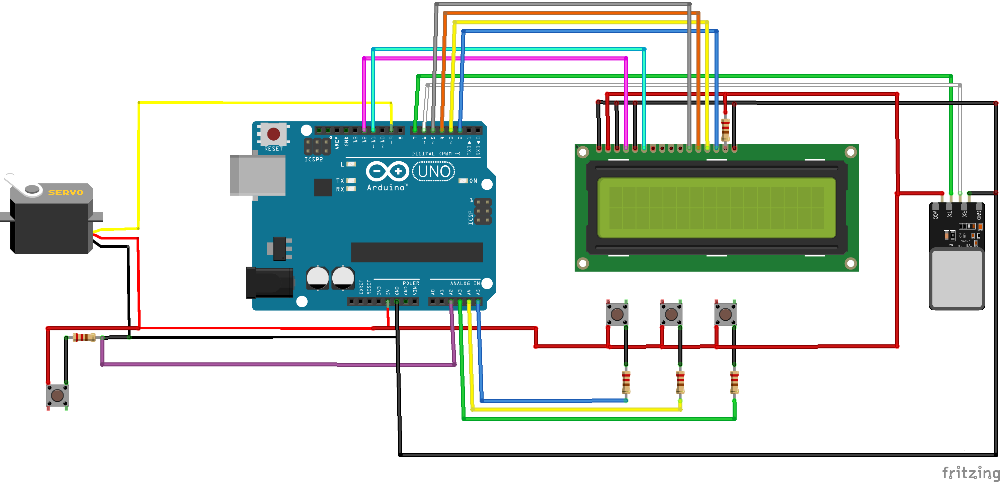

# Fingerprint Door Lock
Attachment for deadbolt door that allows for entry upon matching fingerprint

## Description
Upon a matching fingerprint, the servo motor turns the deadbolt, unlocking the door. Users may also unlock the door from the inside with a push button. An LCD displays instructions and welcome messages when users unlock the door.
The three buttons beneath the LCD allow for fingerprints to be added or deleted with a valid fingerprint to start the process.
3D printed parts adapted from [this Youtube video](https://www.youtube.com/watch?v=bAcK80fm1_0&list=PLWW-NpIwXamBTbpzTbuVF-Yyq9JT1eWwv&index=5&t=0s) were used for the housing and lock adapter. I made a third part to house the LCD, buttons, and fingerprint scanner to allow for a compact design and easy mounting on the outside of the door.

## Circuit Diagram

